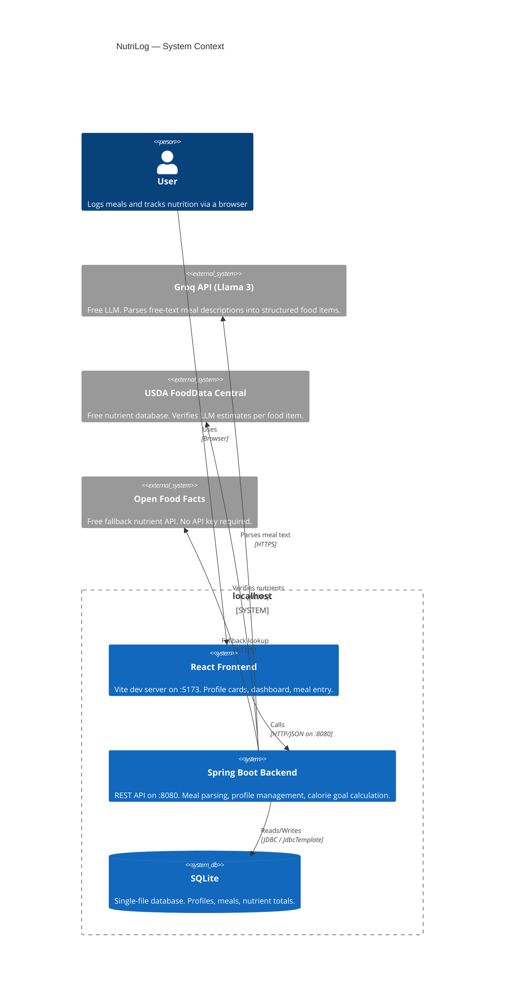
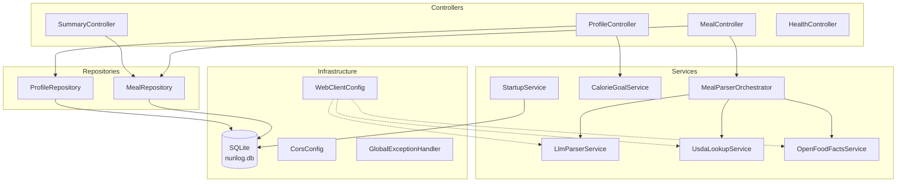
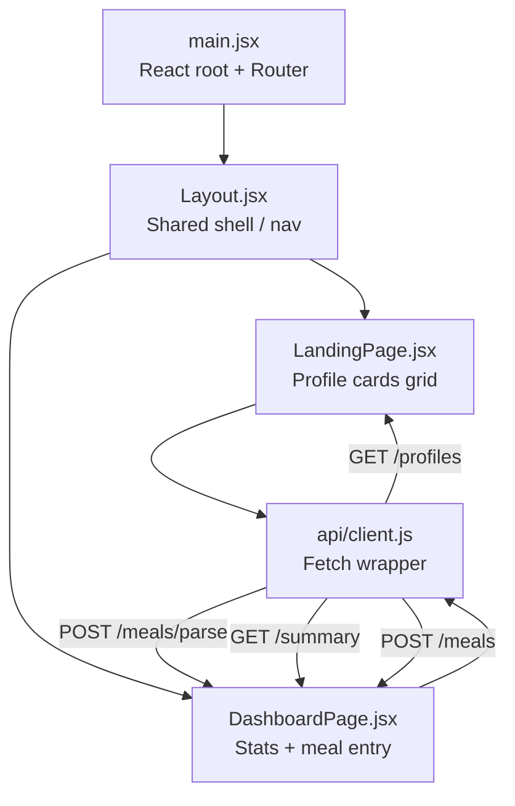
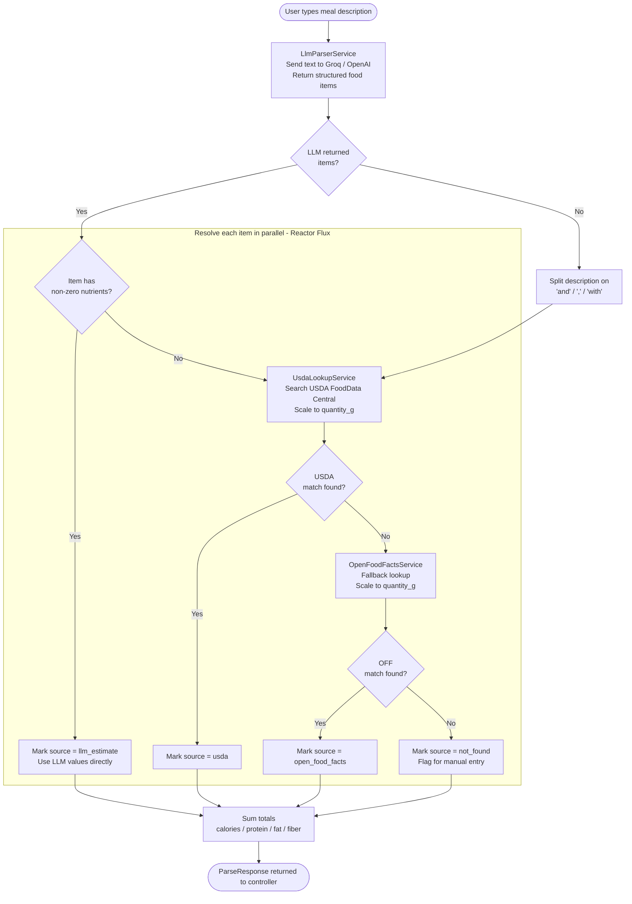
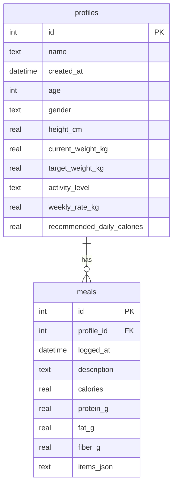
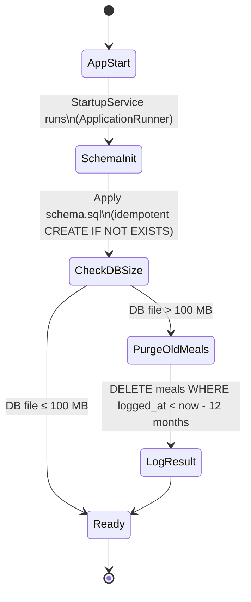
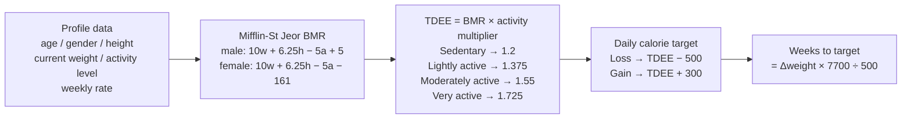

# NutriLog — Architecture Document

> **Version:** 1.0  
> **Date:** 2026-05-25  
> **Stack:** React 19 + Vite / Spring Boot 3 / SQLite

---

## 1. System Overview

NutriLog is a locally-hosted, zero-cost nutrition tracker. All components run on a single machine — no cloud, no accounts, no paid infrastructure required.



---

## 2. Component Architecture

### 2.1 Backend Layers



### 2.2 Frontend Structure



---

## 3. Meal Parsing Pipeline

The pipeline is the core of NutriLog. It runs entirely on the backend and produces structured nutrient data from a plain-English meal description.



### Source badge values

| `source` value | Meaning |
|---|---|
| `usda` | Nutrients from USDA FoodData Central (most authoritative) |
| `open_food_facts` | Nutrients from Open Food Facts fallback |
| `llm_estimate` | LLM returned plausible nutrient data; no external API match needed |
| `not_found` | No data found anywhere — frontend shows manual entry field |

---

## 4. API Request/Response Flow

```mermaid
sequenceDiagram
    participant U as User (Browser)
    participant FE as React Frontend
    participant BE as Spring Boot
    participant LLM as Groq / OpenAI
    participant USDA as USDA API
    participant OFF as Open Food Facts
    participant DB as SQLite

    U->>FE: Types "2 scrambled eggs and toast with butter"
    FE->>BE: POST /meals/parse { description }
    BE->>LLM: Chat completion request
    LLM-->>BE: [{name, quantity_g, calories, protein_g, fat_g, fiber_g}, ...]
    par USDA lookup per item
        BE->>USDA: GET /foods/search?query=scrambled+eggs
        USDA-->>BE: Nutrient data (scaled to quantity_g)
    and
        BE->>USDA: GET /foods/search?query=toast
        USDA-->>BE: Nutrient data
    end
    Note over BE: Items with no USDA match → Open Food Facts
    BE->>OFF: GET /cgi/search.pl?search_terms=butter
    OFF-->>BE: Nutrient data
    BE-->>FE: ParseResponse { items[], totals{} }
    FE->>U: Shows breakdown preview per food item

    U->>FE: Clicks "Save Meal"
    FE->>BE: POST /meals { profile_id, description, items[], totals }
    BE->>DB: INSERT INTO meals
    DB-->>BE: OK
    BE-->>FE: 201 Created
    FE->>BE: GET /summary?profile_id=1&date=today
    BE->>DB: SELECT SUM(calories) ...
    DB-->>BE: today_calories, week_calories
    BE-->>FE: SummaryResponse
    FE->>U: Dashboard totals refresh
```

---

## 5. Database Schema



**Schema notes:**
- `items_json` stores the raw `ParsedFoodItem[]` array as a JSON blob — no separate items table.
- Both tables use `CREATE TABLE IF NOT EXISTS` so the schema is re-applied idempotently on every startup.
- Indexes on `meals.profile_id` and `meals.logged_at` cover the common query patterns (`GET /meals` filter + `GET /summary` aggregation).

---

## 6. Startup Lifecycle



---

## 7. Calorie Goal Calculation

Implemented in `CalorieGoalService` — pure Java, no external API.



---

## 8. Configuration & Environment

| Variable | Required | Default | Source |
|---|---|---|---|
| `GROQ_API_KEY` | Yes (default LLM) | — | Free — console.groq.com |
| `USDA_API_KEY` | Yes | — | Free — fdc.nal.usda.gov |
| `LLM_PROVIDER` | No | `groq` | `groq` or `openai` |
| `OPENAI_API_KEY` | Only if `openai` | — | api.openai.com |
| `NUTRILOG_DB_PATH` | No | `./backend/nutrilog.db` | Override SQLite path |

**LLM switching:** both providers use the OpenAI-compatible chat API. `LlmParserService.callLlmApi()` handles both with a single code path — only the base URL and API key change.

**SQLite pool:** `hikari.maximum-pool-size=1`. SQLite does not support concurrent writes; this must never be increased.

---

## 9. Key Design Decisions

| Decision | Choice | Rationale |
|---|---|---|
| LLM-first parsing | Groq (Llama 3) primary; USDA + Open Food Facts verify | Handles regional/colloquial food names that keyword matching misses; Groq free tier = zero cost |
| Parallel API calls | Reactor `Flux.flatMap` | USDA lookups per item are independent — parallel cuts wall-clock time significantly |
| No ORM | Raw `JdbcTemplate` | Schema is small; JdbcTemplate is sufficient and avoids Hibernate startup overhead |
| Single SQLite file | `hikari.maximum-pool-size=1` | Local-only app; zero setup; all data in one portable file |
| `items_json` blob | JSON column on `meals` | Avoids a third table for food items; query patterns only need meal-level aggregates |
| Graceful degradation | 4-step pipeline with `not_found` fallback | Every step can fail independently; user always gets a result they can correct manually |
